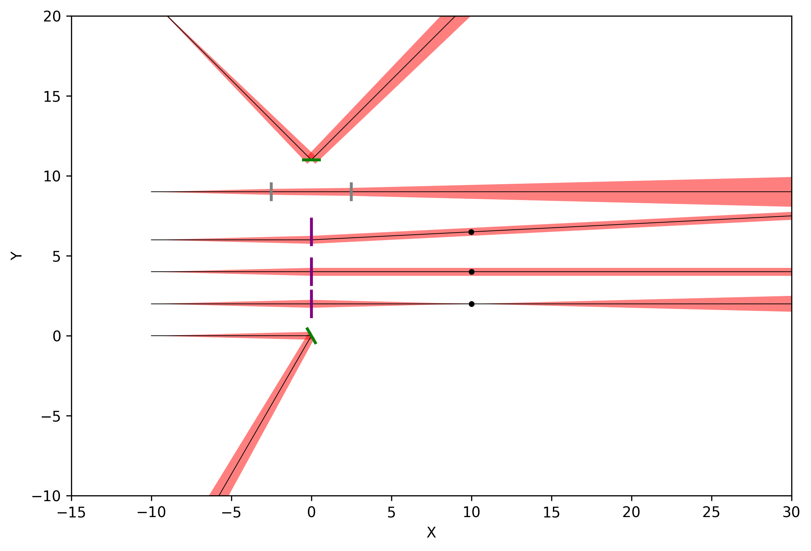

<div align="center">


## Optable — Ray tracing on an Optical table

A simple ray tracing and visualization tool for freespace optics.

dedicated to phys students working with freespace optics.

[](https://www.python.org/)
[](LICENSE)
[](https://github.com/tim4431/optable/stargazers)
[](https://github.com/tim4431/optable/network/members)
[](https://github.com/tim4431/optable/issues)
[](https://github.com/tim4431/optable/pulls)

For documentation see [online documentation on Read The Docs](https://optable.readthedocs.io/en/latest/).

For examples of use check [Examples](https://optable.readthedocs.io/en/latest/examples/index.html).

[](http://optable.readthedocs.io)
[](https://badge.fury.io/py/optable)

</div>

## Installation
```python
pip install -r requirements.txt
```

## Example

**Gaussian beam tracing**

```python
import numpy as np, sys, matplotlib.pyplot as plt

sys.path.append("../src/")
from optical_component import *
from optical_table import OpticalTable
from component_group import GlassSlab

if __name__ == "__main__":
    fig, ax0 = plt.subplots(1, 1, figsize=(12, 6))


wl = 780e-9
w0 = 10e-6


r0 = [
    Ray([-10, 0, 0], [1, 0, 0], wavelength=wl, w0=w0),
    Ray([-10, 2, 0], [1, 0, 0], wavelength=wl, w0=w0),
    Ray([-10, 4, 0], [1, 0, 0], wavelength=wl, w0=w0),
    Ray([-10, 6, 0], [1, 0, 0], wavelength=wl, w0=w0),
    Ray([-10, 9, 0], [1, 0, 0], wavelength=wl, w0=w0),
    Ray([-10, 21, 0], [1, 0, 0], wavelength=wl, w0=w0).RotZ(-np.pi / 4),
]

m0 = Mirror([0, 0, 0]).RotZ(np.pi / 6)
l0 = Lens([0, 2, 0], radius=0.8, focal_length=5)
l1 = Lens([0, 4, 0], radius=0.8, focal_length=10)
l2 = Lens([0, 6.5, 0], radius=0.8, focal_length=10)
slab0 = GlassSlab([0, 9, 0], n1=1, n2=2, thickness=5)
m1 = Mirror([0, 11, 0]).RotZ(-np.pi / 2)

# Summary, rays, components, monitors
rays = r0
components = [m0, l0, l1, l2, slab0, m1]
monitors = []

table = OpticalTable()
table.add_components(components)
table.add_monitors(monitors)
table.ray_tracing(rays)

# ax0.annotate(mon0.ndata, (mon0.origin[0], mon0.origin[1]), fontsize=15, color="black")
table.render(
    ax0,
    type="Z",
    gaussian_beam=True,
    spot_size_scale=1,
    roi=[-15, 30, -10, 20],
)

if __name__ == "__main__":
    # plt.axis("off")
    plt.savefig("../docs/gaussian_beam.png", dpi=300, bbox_inches="tight")
    plt.show()
```

**Result**

